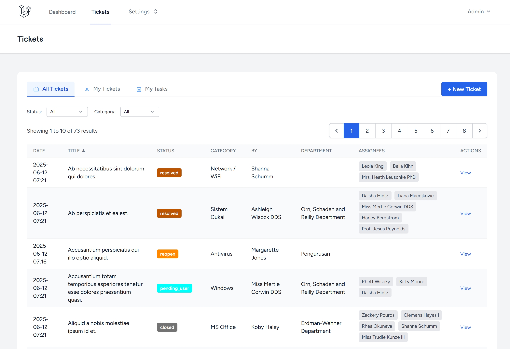
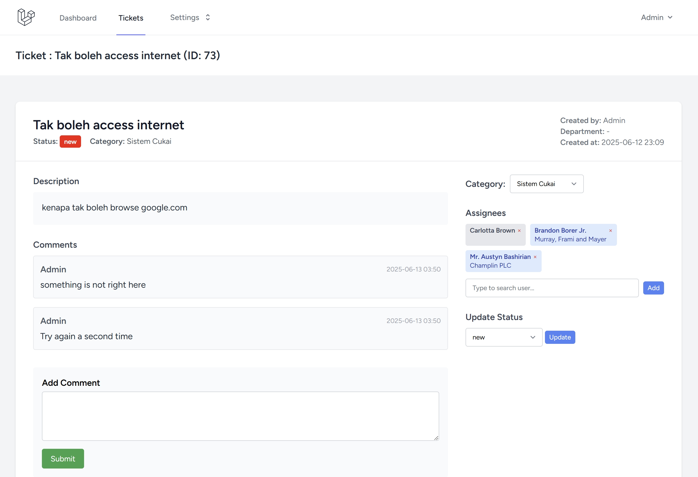

# ITH Ticketing System

This is a ticketing/helpdesk system built with [Laravel](https://laravel.com/).  
It is designed for IT, user, and vendor collaboration, with role-based access and management for tickets, users, departments, vendors, categories, and ticket statuses.





## Features

- Ticket creation, assignment, and status tracking
- Role-based access for Admin, IT, User, and Vendor
- Management modules for Users, Departments, Vendors, Categories, and Ticket Statuses
- Modern UI using Tailwind CSS (via Laravel Breeze)
- MIT Open Source License

## Missing Features

These features are **not** yet developed

- Kanban view

## Installation

1. **Clone the repository:**
    ```bash
    git clone git@github.com:kidino/ith.git
    cd ith
    ```

2. **Install dependencies:**
    ```bash
    composer install
    npm install
    ```

3. **Copy and configure your environment:**
    ```bash
    cp .env.example .env
    ```
    Edit `.env` and set your database and mail settings.

4. **Generate application key:**
    ```bash
    php artisan key:generate
    ```

5. **Run migrations and seeders:**
    ```bash
    php artisan migrate
    php artisan db:seed
    ```

6. **⚠️ IMPORTANT - Change Default Admin Credentials:**
    
    A default admin user is created during migration with these credentials:
    - **Email:** `admin@admin.com`
    - **Password:** `Admin123`
    
    **🔒 SECURITY WARNING:** You MUST change these default credentials before deploying to production!
    
    **Option A: Update the existing admin user**
    ```bash
    # Access your application at http://localhost:8000
    # Login with admin@admin.com / Admin123
    # Go to Profile and update email/password
    ```
    
    **Option B: Create a new admin user and delete the default**
    ```bash
    # Use the application to create a new admin user, then delete the default one
    ```

7. **Build frontend assets:**
    ```bash
    npm run build
    ```

8. **Start the development server:**
    ```bash
    php artisan serve
    ```

9. **Access the application:**
    Open [http://localhost:8000](http://localhost:8000) in your browser.
    
    **First Login:**
    - Email: `admin@admin.com`
    - Password: `Admin123`
    
    ⚠️ **Remember to change these credentials immediately after first login!**

## Automated Ticket Management

The system includes automated ticket status updates and scheduled tasks for improved workflow efficiency.

### Ticket Automation Features

- **Automatic Status Updates**: Tickets automatically change status based on user actions
- **Smart Notifications**: Email and in-app notifications for relevant users
- **Auto-Closure**: Resolved tickets automatically close after 7 days of inactivity

### Setting Up Laravel Scheduling

To enable automatic ticket closure and other scheduled tasks, you need to set up Laravel's task scheduling.

#### 1. **Production Setup (Linux/Unix servers)**

Add this cron entry to your server's crontab:

```bash
# Edit crontab
crontab -e

# Add this line (replace /path/to/your/project with actual path)
* * * * * cd /path/to/your/project && php artisan schedule:run >> /dev/null 2>&1
```

#### 2. **Development Setup (Local environments)**

**Option A: Using Laravel's built-in scheduler (Recommended for development)**
```bash
# Run this command in your project directory
php artisan schedule:work
```

**Option B: Windows Task Scheduler**
1. Open Task Scheduler (`taskschd.msc`)
2. Create Basic Task
3. Name: "Laravel ITH Scheduler"
4. Trigger: Daily at startup
5. Action: Start a program
6. Program: `php.exe`
7. Arguments: `artisan schedule:run`
8. Start in: `C:\path\to\your\ith\project`

**Option C: Manual execution (for testing)**
```bash
# Test the auto-close command manually
php artisan tickets:auto-close-resolved

# Or run all scheduled tasks once
php artisan schedule:run
```

#### 3. **Docker Setup**

Add this to your Docker container or use a separate cron container:

```dockerfile
# Add to your Dockerfile or create a separate cron service
RUN echo "* * * * * cd /var/www && php artisan schedule:run >> /dev/null 2>&1" >> /etc/crontab
```

### Automation Rules

The system automatically updates ticket status based on these rules:

| **User Action** | **From Status** | **To Status** | **Condition** |
|-----------------|-----------------|---------------|---------------|
| IT/Admin comments | `new` | `in_progress` | First response |
| Vendor assigned | Any (not resolved/closed) | `pending_vendor` | Vendor user assigned |
| Vendor comments | `pending_vendor` | `in_progress` | Vendor provides update |
| User comments | `pending_user` | `in_progress` | User provides info |
| Admin resolves | Any | `resolved` | Only admins can resolve |
| Auto-closure | `resolved` | `closed` | After 7 days no activity |

### Verification

To verify scheduling is working:

```bash
# Check if commands are registered
php artisan schedule:list

# Test the auto-close command
php artisan tickets:auto-close-resolved

# Check Laravel logs for automation activity
tail -f storage/logs/laravel.log
```

## Default Users & Security

### Default Admin User
The system creates a default administrator account during installation:
- **Email:** `admin@admin.com`  
- **Password:** `Admin123`

### 🔐 Security Best Practices

1. **Change default credentials immediately** after installation
2. **Use strong passwords** for all user accounts
3. **Enable email verification** in production environments
4. **Review user permissions** regularly
5. **Monitor system logs** for suspicious activity

### Production Deployment Checklist

- [ ] Change default admin email and password
- [ ] Configure proper mail settings in `.env`
- [ ] Set up HTTPS/SSL certificates
- [ ] Configure cron jobs for Laravel scheduling
- [ ] Set up proper backup procedures
- [ ] Review and update `.env` security settings

## Development Notes

- This project is mostly developed using **GitHub Copilot** to demonstrate AI-assisted software development and for learning purposes.
- The codebase is intended for educational use and as a reference for building Laravel-based systems.

## License

This project is open-sourced under the [MIT license](LICENSE).
